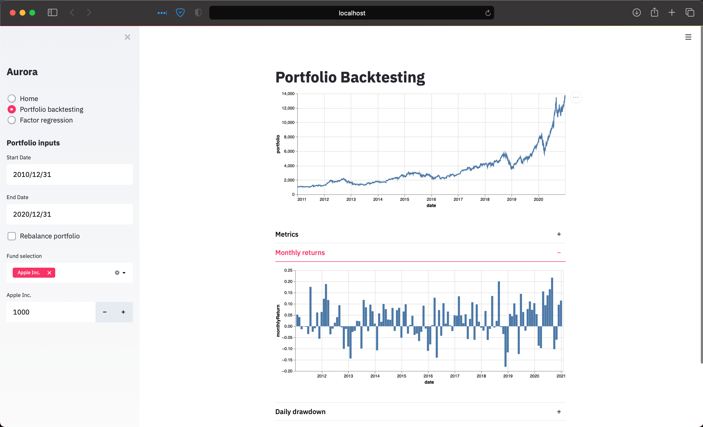
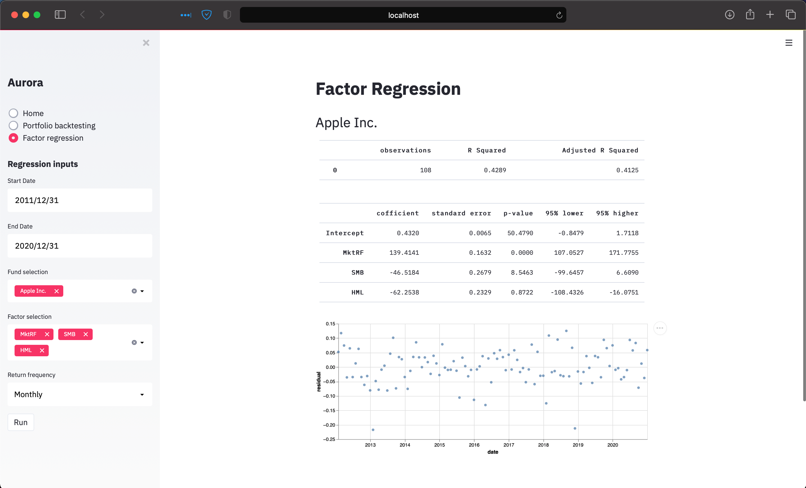

# Aurora
<p>
    <em>Understanding financial markets</em>
</p>

### Portfolio Backtesting


### Factor Analysis


### Supported features:
- Backtesting portfolios
    - Rebalancing strategies
    - Annual growth rate
    - Sharpe ratio
    - Max drawdown
- Factor Analysis:
    - French Fama factor model

### Installation:
Quick and easy local deployments using docker-compose, simply run:
```html
docker-compose up --force-recreate --build -d
```

[http://127.0.0.1:8000/docs](http://127.0.0.1:8000/docs) for interactive api docs

[http://127.0.0.1:8501](http://127.0.0.1:8501) for streamlit application

Automated testing of backend using pytest, run on docker instance
```html
pytest -p no:cacheprovider 
```

### Major Dependencies:
**Fastapi:** https://github.com/tiangolo/fastapi

**Streamlit:** https://github.com/streamlit/streamlit

**Docker:** https://www.docker.com

### Continous integration
**Github Actions:** https://github.com/yeungadrian/aurora/actions
- Lint: Black https://github.com/psf/black#github-actions
- Integration tests using pytest: https://fastapi.tiangolo.com/tutorial/testing/

### Architecture:
- Goals:
1. Build out financial models to improve knowledge
2. Use financial models on real life data with interactive application

- Fastapi backend
    - Standard fastapi code structure based loosely on https://fastapi.tiangolo.com/project-generation/
    - Only integration tests: cover all endpoints, allows to see if refactoring has changed calculations accidently
- Streamlit front end
    - Financial analysis requires visualisation, very difficult to get intuitive sense without visualisations and so command line gui's are ruled out
    - Do not want to learn javascript at the moment and so restricted to python libraries such as streamlit, dash
    - Streamlit looks to be the best to prototype something as fast as possible
    - Not worth investing in automated tests here yet
- Data
    - Calling api's directly is too slow, especially when doing analysis of many funds, when using free tiers anyway
    - Data is stored as parquet files (compressed files)
    - Avoiding databases for now as the focus is on building models
    - Free API's are either too slow or have limits, which will be breached just deploying the app and testing changes
    
### Roadmap of functionality:
    - [x] Add images of app to readme
    - [x] Factor Regression: French Fama
    - [ ] Intuitive feedback on output of factor regression
    - [ ] Tidy up routes of backend
    - [ ] Deployment to a cloud provider
