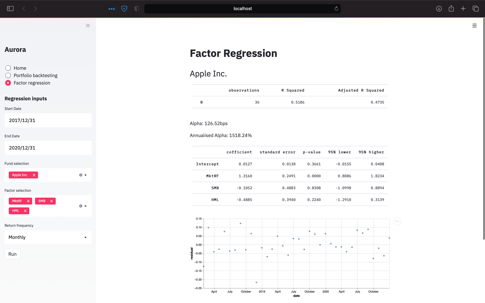

# Aurora
<p>
    <em>Understanding financial markets</em>
</p>

### Portfolio Backtesting


## Factor Analysis



### Supported features:
- Backtesting portfolios
    - Rebalancing strategies
    - Annual growth rate
    - Sharpe ratio
    - Max drawdown
- Factor Analysis:
    - French Fama factor model

### Installation:
Quick and easy local deployments using docker-compose, simply run:
```html
docker-compose up --force-recreate --build -d
```

[http://127.0.0.1:8000/docs](http://127.0.0.1:8000/docs) for interactive api docs

[http://127.0.0.1:8501](http://127.0.0.1:8501) for streamlit application

Automated testing of backend using pytest, run on docker instance
```html
pytest -p no:cacheprovider 
```

### Major Dependencies:
**Fastapi:** https://github.com/tiangolo/fastapi

**Streamlit:** https://github.com/streamlit/streamlit

**Docker:** https://www.docker.com

### Continous integration
**Github Actions:** https://github.com/yeungadrian/aurora/actions
- Lint: Black https://github.com/psf/black#github-actions
- Integration tests using pytest: https://fastapi.tiangolo.com/tutorial/testing/


### Roadmap of functionality:
    - [x] Add images of app to readme
    - [x] Factor Regression: French Fama
    - [x] Tidy up routes of backend
    - [x] Intuitive feedback on output of factor regression
    - [ ] Deployment to a cloud provider
